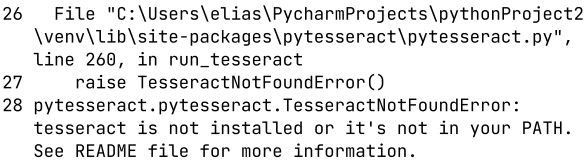

# Python: pdf-file-read-validate-automation

## Description 
Automation using Python libs and OCR technology to download PDF files at web and validate if is accordingly with title, simulating candidates certificates analysis in a selective process made by HR.

## Preface
That idea automation was born in my actual job, when I heard a functionary asking if someone know a software to download PDF files automatic. Coincidentally two months ago (09/11/2022) I was working in a personal project to download web files and I thought: I can make it, sometime later I asked what him needed. He gave me more information, told me needed a software/automation to download  candidates courses certificates in PDF format and validate if it's correct and is not a cake recipe, so come with me in this adventure.

## Introduction
To do this automation need install some libraries in Python like:

<ul>
    <li><b>selenium:    </b> automate Web Navigate and Web Scraping (download files and other things)   </li> 
    <li><b>PyPDF2:      </b> treat PDF files (reading)                                                  </li> 
    <li><b>pdf2image:   </b> treat PDF images (reading)                                                 </li> 
    <li><b>pytesseract: </b> use OCR technology to read certificate text when that's image              </li>
</ul>

## Installing libraries
I don't want to make a download tutorial, because I'm a beginner on this IDE and have fear to influence someone do any wrong thing, so I put other tutorial links I used to make this work.

<table>
<tr><td>Library</td>    <td>Install                                                                 </td>   </tr>
<tr><td>Selenium</td>   <td><a>https://selenium-python.readthedocs.io/installation.html</a>         </td>   </tr>
<tr><td>PyPDF2</td>     <td><a>https://pypdf2.readthedocs.io/en/latest/user/installation.html</a>   </td>   </tr>
<tr><td>Tesseract</td>  <td><a>https://tesseract-ocr.github.io/tessdoc/Installation.html</a>        </td>   </tr>
</table>

### Observations
<li>For selenium I used chromedriver, I don't know its best choice but this way worked for my code and I think people majority have familiar with Chrome, so we go use it.</li> 

<li>If you are using Windows and after installations get error like this:    </li>   
Can be because pytessaract library is not seeing tesseract.exe, so you can try change path of executable manually in used library folder, where your pytesseract is installed: 

## Code explain

